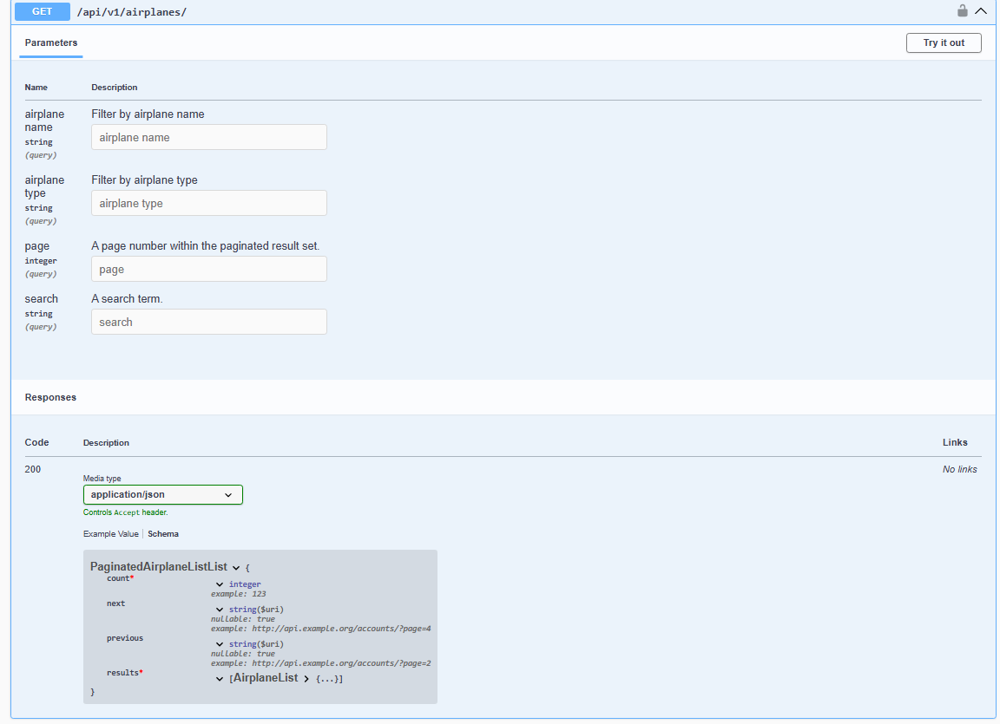

# ✈️🌍 Airport Service API 🚀💼  

**Airport Service API** is a powerful 🌟 **RESTful API** designed for managing **aviation operations** 🛫. It includes functionalities for **countries** 🌍, **cities** 🏙️, **airports** 🏢, **airplanes** ✈️, **routes** 🗺️, **flights** 🛬, **tickets** 🎟️, and **orders** 📦.  

---

## 📌 **Key Features & Technologies** 🔥  

✅ **Django REST Framework (DRF)** ⚙️ – Provides robust and flexible API development.  
✅ **PostgreSQL** 🛢️ – A powerful database for managing aviation-related data.  
✅ **JWT Authentication** 🔑 – Secure user access and token-based authentication.  
✅ **Role-Based Access Control (RBAC)** 👥 – Granular permission management.  
✅ **Swagger/OpenAPI Documentation** 📄 – Auto-generated, interactive API documentation.  
✅ **Django ORM** 🔗 – Database interactions with ease.  
✅ **Docker & Docker Compose** 🐳 – Easy deployment & scalability.
✅ **Throttling & Rate Limiting** ⚡ – Prevents API abuse & excessive traffic.  
✅ **Full-Text Search & Filtering** 🔍 – Efficiently search flights, routes & more.  

---

## 📦⚙️ Installation & Setup 🛠️  

To **run the project locally**, follow these steps:  

### 🏗️ 1. **Clone the repository** 🖥️  
```bash
git clone https://github.com/your-username/airport-service.git
cd airport-service
```  

### 🔄 2. **Create a virtual environment** 🏗️  
```bash
python -m venv venv
source venv/bin/activate  # For Linux/Mac 🐧🍏
venv\Scripts\activate    # For Windows 🏁
```  

### 📜 3. **Install dependencies** 📦  
```bash
pip install -r requirements.txt
```  

### 🔧 4. **Set up environment variables** ⚡  
Create a `.env` file to configure your environment 🌍:  
```bash
# 🔑 Django Secrets
DJANGO_SECRET_KEY=<django-secret-key>
DJANGO_SETTINGS_MODULE=<config.settings.dev>

# 🛢️ Database Credentials
POSTGRES_PASSWORD=<password>
POSTGRES_USER=<user>
POSTGRES_DB=<the_best_db>
POSTGRES_HOST=<localhost>
POSTGRES_PORT=<5432>
PGDATA=</var/lib/postgresql/data>
```  

### 📊 5. **Load data into the database** 🏛️  
```bash
python manage.py loaddata dump.json
```  

### ▶️ 6. **Run the server** 🖥️  
```bash
python manage.py runserver
```  

### 🌐 7. **Open the application** 🌍  
The server will be available at **[http://127.0.0.1:8000](http://127.0.0.1:8000)**  

---

## 🐳🚀 Deployment via Docker 📦  

Easily deploy the project using **Docker Compose** 🐋:  
```bash
docker-compose up --build
```  

This will automatically start **PostgreSQL** 🛢️ and the **Django API** ⚡.  


## 🚀 Deployment via Docker  

The project can be run in containers using `docker-compose`.  

```bash
docker-compose up --build
```  

This will automatically start PostgreSQL and the Django API.  

### 📦 `docker-compose.yml`  

```yaml
services:
   service_api:
       build:
           context: .
       ports:
           - "8001:8000"
       command: >
           sh -c "python manage.py makemigrations && python manage.py migrate &&
                     python manage.py runserver 0.0.0.0:8000"
       volumes:
           - ./:/app
           - my_media:/files/media
       env_file:
           - .env
       depends_on:
           - db

   db:
       image: postgres:17-alpine3.19
       restart: always
       env_file:
           - .env
       ports:
           - "5432:5432"
       volumes:
           - db_airport_service_api:$PGDATA

volumes:
    db_airport_service_api:
    my_media:
```  

### 🐳 `Dockerfile`  

```dockerfile
FROM python:3.10-alpine3.18
LABEL maintainer="b4oody"

ENV PYTHONNBUFFERED 1

WORKDIR app/

COPY requirements.txt requirements.txt
RUN pip install -r requirements.txt

COPY . .

RUN mkdir -p /files/media

RUN adduser \
    --disabled-password \
    --no-create-home \
    my_user

RUN chown -R my_user /files/media
RUN chmod -R 755 /files/media

USER my_user
```  

---

## 📜🔥 API Documentation (Swagger)  

The API is fully documented using **Swagger UI** 📖, making it easy to **explore and test endpoints** directly from the browser 🌍.  

📌 **Swagger UI**: http://127.0.0.1:8000/api/v1/schema/swagger/
  

🖼️ **Example API Request Execution**:  
  

---

## 📊🗃️ Database Schema  

The following **ER diagram** represents the database schema used in this project 🔍📂:  

📌 **ER Diagram**:  
  

---

## 📂📁 Project Structure  

```
📂 project-root/
├── ✈️ air_service/        # Main app (models, views, serializers)
│   ├── 📂 migrations/     # Database migrations
│   ├── 🏛️ admin.py        # Admin panel
│   ├── ⚙️ apps.py         # App configuration
│   ├── 📊 models.py       # Database models
│   ├── 🔒 permissions.py  # Custom permissions
│   ├── 🔄 serializers.py  # API serializers
│   ├── 🧪 tests.py        # Testing
│   ├── 🔀 urls.py         # Routes
│   ├── 🎯 views.py        # Request handlers
├── ⚙️ config/             # Django settings
│   ├── 🔧 settings/       # Configuration files
│   │   ├── 🛠️ base.py     # Base settings
│   │   ├── 🏗️ dev.py      # Dev settings
│   │   ├── 🚀 prod.py     # Prod settings
│   ├── 🌐 urls.py        # Main routes
│   ├── 🎭 asgi.py        # ASGI configuration
│   ├── 🔥 wsgi.py        # WSGI configuration
├── 👤 user/               # User logic
│   ├── 🏗️ migrations/     # Database migrations
│   ├── 🏛️ admin.py        # Admin panel
│   ├── 🔄 serializer.py   # Serializers
│   ├── 🧪 tests.py        # Testing
│   ├── 🔀 urls.py         # Routes
│   ├── 🎯 views.py        # Request handlers
├── 🎨 templates/          # HTML templates
├── 🔑 .env                # Environment variables
├── 📜 README.md           # Project documentation
├── 📝 requirements.txt    # Dependencies
├── 🐳 docker-compose.yaml # Docker configuration
└── ⚙️ manage.py           # Django CLI
```  

---

## 🔑✨ Main API Endpoints  

| 🌍 **Endpoint** | 📄 **Description** |
|------------|------------------|
| **`/countries/`** 🌎 | Manage **countries** |
| **`/cities/`** 🏙️ | Manage **cities** |
| **`/airports/`** 🛫 | Manage **airports** |
| **`/airplanes/`** ✈️ | Manage **airplanes** |
| **`/routes/`** 🗺️ | Manage **routes** |
| **`/flights/`** 🛬 | Manage **flights** |
| **`/orders/`** 🎫 | Manage **orders & tickets** |

📌 OpenAPI Documentation: [`/schema/swagger/`](http://127.0.0.1:8000/schema/swagger-ui/)  

---

## 🔐🛡️ Authentication & Security  

The API supports multiple authentication methods 🔑:  
- ✅ **JWT Authentication** (`djangorestframework-simplejwt`) 🔥  
- ✅ **Token Authentication** (Django Rest Framework Token) 🛡️  
- ✅ **Basic Authentication** (for testing environments) 🧪  

🔒 **Role-Based Access Control (RBAC)** & **Custom Permissions** ensure **secure access** 🚀.  
⚡ **Rate Limiting & Throttling** are implemented to **prevent abuse** 🏗️.  

## 👤 Author
**Vladyslav Rymarchuk**  
[GitHub](https://github.com/b4oody/) | [LinkedIn](https://www.linkedin.com/in/%D0%B2%D0%BB%D0%B0%D0%B4%D0%B8%D1%81%D0%BB%D0%B0%D0%B2-%D1%80%D0%B8%D0%BC%D0%B0%D1%80%D1%87%D1%83%D0%BA-aa62a4202/)
